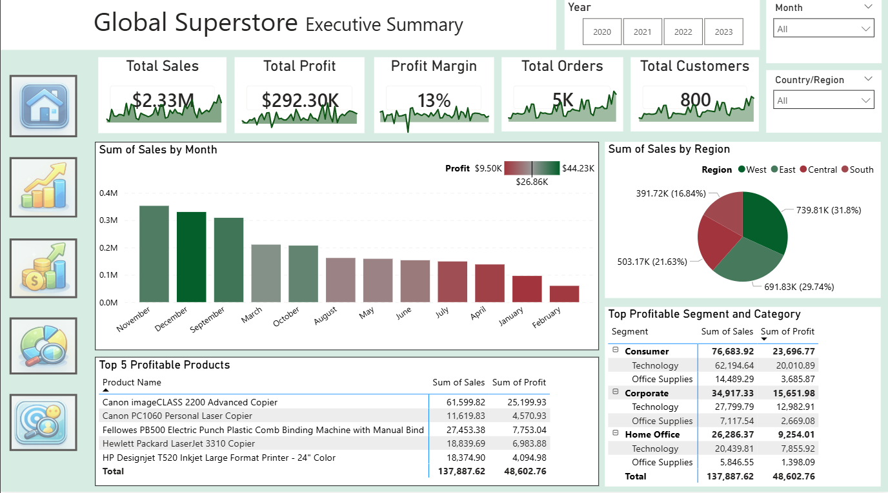
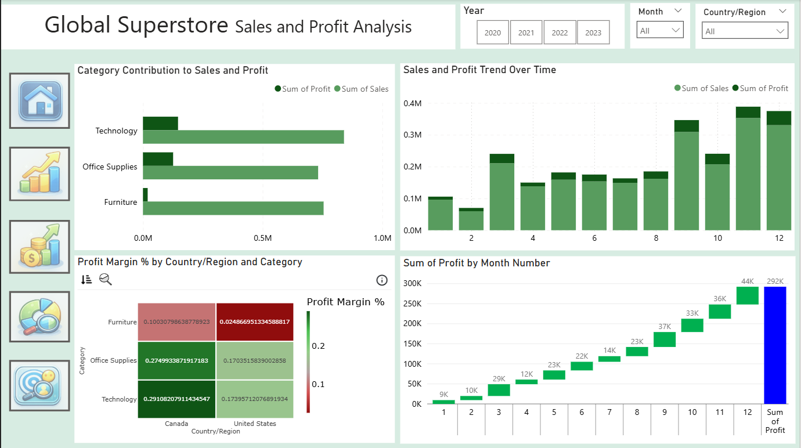
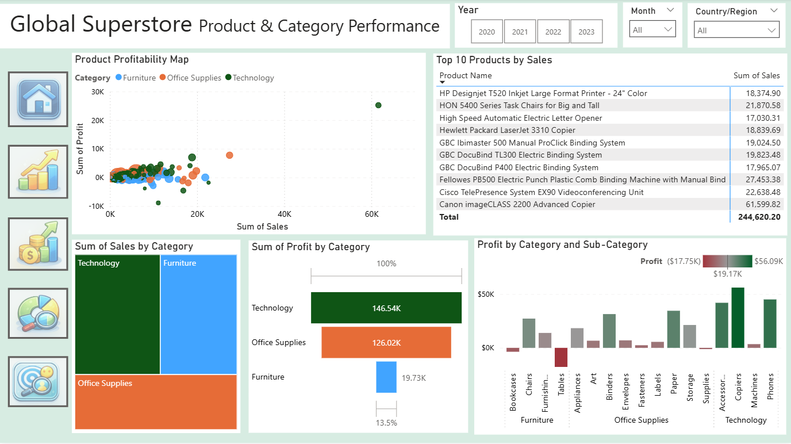
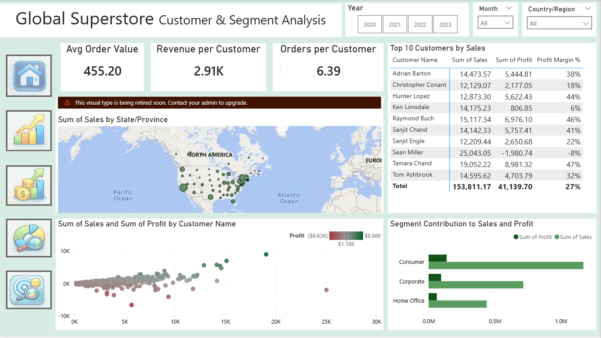

# Global Superstore Power BI Dashboard

An interactive Business Intelligence dashboard built using **Power BI** to analyze the Global Superstore retail dataset.

This project provides insights into sales performance, product profitability, regional contribution, and customer behavior from 2020–2023.

---

## 🔗 Live Interactive Dashboard

👉 **View Live Dashboard Here:**  
https://app.powerbi.com/groups/me/reports/0a4f249e-3ee7-42cf-84b5-fec2c9d4c784?ctid=4ad56207-f4a7-403b-b32a-65acc80542e1&pbi_source=linkShare

> Note: If Publish to Web is enabled, the dashboard will open directly. Otherwise, Power BI login may be required.

---

## 📊 Project Overview

This dashboard helps answer key business questions:

- Which product categories generate the highest profit?
- Which regions contribute the most revenue?
- Who are the most valuable customers?
- How do sales and profit trend over time?
- Which segments drive business growth?

---

## 📁 Repository Structure

```
Dashboard/
    Global Superstore - Power BI Project.pbix

Data/
    orders.xlsx
    people.xlsx
    returns.xlsx

Pictures/
    Executive_Summary.png
    Sales and Profit Analysis.png
    Product & Category Performance.png
    Customer & Segment Analysis.png

LICENSE
README.md
```

---

# 📸 Dashboard Preview

---

## 1️⃣ Executive Summary



**Key Highlights:**
- Total Sales: $2.33M
- Total Profit: $292K
- Profit Margin: 13%
- 800 Customers | 5K Orders
- Region-wise contribution analysis
- Top 5 profitable products

---

## 2️⃣ Sales & Profit Analysis



**Insights:**
- Monthly sales and profit trend
- Category contribution comparison
- Profit margin by country and category
- Seasonal performance patterns

---

## 3️⃣ Product & Category Performance



**Insights:**
- Product profitability distribution
- Top 10 products by sales
- Category-level sales comparison
- Sub-category profit breakdown

---

## 4️⃣ Customer & Segment Analysis



**Insights:**
- Top 10 customers by revenue
- Revenue per customer
- Orders per customer
- Segment-wise sales contribution
- Geographic distribution of customers

---

# 📈 Key Business Insights

- Technology category generates the highest overall profit.
- Consumer segment contributes the largest share of total sales.
- Furniture category has lower profit margins compared to other categories.
- Some high-revenue customers generate lower profit margins.
- Sales show stronger growth in later months of the year.

---

# 🛠 Tools & Technologies Used

- Power BI
- Data Visualization
- Business Intelligence
- Data Analysis

---

# 🚀 Future Improvements

- Add sales forecasting using time-series modeling
- Implement predictive customer segmentation
- Integrate real-time data refresh
- Expand KPIs with advanced DAX measures

---

⭐ If you found this project interesting, feel free to star the repository!
